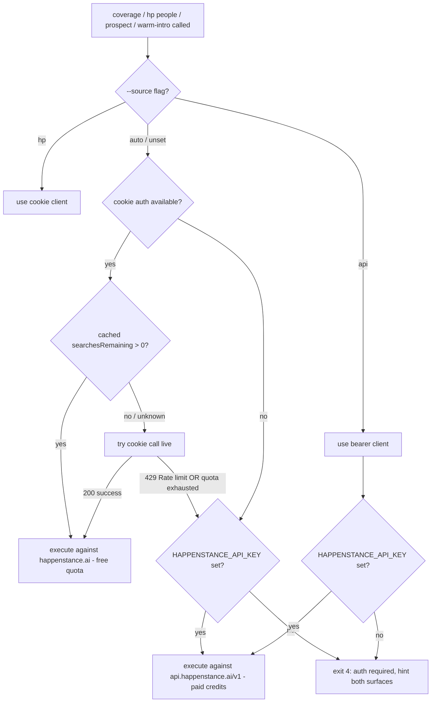

# feat(contact-goat): integrate Happenstance public REST API as a first-class auth surface

## Overview

contact-goat currently ships a single Happenstance integration: a sniffed replay of the happenstance.ai web app that authenticates via Chrome session cookies and is gated by the web-app monthly search allocation (free tier: 14 searches/mo). When that allocation is exhausted, every Happenstance-touching command (`coverage`, `hp people`, `prospect`, `warm-intro`, `dossier`, `waterfall`) returns a `429 Rate limit reached` until the renewal date. Reproduced in-session 2026-04-19: `searchesRemaining=0`, `searchesRenewalDate=2026-05-01`.

Happenstance also ships a documented public REST API at `https://api.happenstance.ai/v1` with bearer-token auth and a credit-based meter (search costs 2 credits, research costs 1 credit on completion). Keys carry the `hpn_live_personal_` prefix, expire every 90 days, and require 2FA. The CLI's own `.printing-press.json` already lists `spec_url: https://developer.happenstance.ai/openapi.json` and `auth_type: composed`, so the public API was the original generator intent. Cookie auth was added as a sidecar to access the free-tier allocation, not as a replacement.

This plan adds the public REST API as a parallel, first-class auth surface alongside the existing cookie path. Both surfaces coexist; the CLI auto-prefers whichever has remaining quota. The work spans a new `internal/happenstance/api` client package (mirroring `internal/deepline/`), config plumbing for `HAPPENSTANCE_API_KEY`, six new top-level command groups (`api search`, `api research`, `api groups`, `api usage`, `api user`, with `find-more` pagination), four new MCP tools, response normalization so existing search-using commands transparently route through the bearer surface, doctor health checks, and the project's first SKILL.md.

## Problem Frame

In-session 2026-04-19, the user ran `coverage NBA --source hp` and `hp people "people who work at the NBA"` four times across two retry windows. Every call returned the same shape:

```
warning: Happenstance graph-search: happenstance POST /api/search:
POST /api/search returned HTTP 429: {"error":"Rate limit reached"}
```

Diagnosis via `contact-goat-pp-cli user --json`:

```
{"searchesRemaining": 0, "searchesRenewalDate": "2026-05-01T00:00:00.000Z"}
```

The web-app surface is the only one wired into the CLI today. There is no fallback, no second auth path, and no way to spend credits on the public API even if the user already pays for them. Until May 1 (12 days), the entire Happenstance surface is dark.

The user has provisioned a public-API key. The work is to plumb it through.

A secondary problem is reach: the public API surfaces capabilities the cookie path does not (deep `research` profiles with employment/education/projects/writings, `groups` membership listings for @mention-style search refinement, structured `usage` telemetry for credit-aware throttling). Adding the API surface unlocks those capabilities at the same time it unblocks search.

## Requirements Trace

- R1. A user with a valid `HAPPENSTANCE_API_KEY` must be able to run `coverage`, `hp people`, `prospect`, and `warm-intro` against the bearer surface without touching the cookie path, and without depending on Chrome being installed.
- R2. When both auth surfaces are present and have remaining quota, the CLI must default to the cookie surface (free web-app allocation) for search-class operations. The bearer surface (paid credits) is the fallback, used only when the cookie path is unavailable, has zero `searchesRemaining`, or returns a quota-class error. Users always spend free quota before paid credits unless they explicitly opt in via `--source api`.
- R3. A new `api` top-level command group must expose every public-API endpoint as a first-class subcommand: `api search`, `api search find-more`, `api search get`, `api research`, `api research get`, `api groups list`, `api groups get`, `api usage`, `api user`.
- R4. The MCP server must expose at least 4 new public-API tools: `api_search`, `api_research`, `api_groups_list`, `api_usage`. Total `mcp_tool_count` increases from 12 to at least 16.
- R5. `doctor` must check API key presence, validity (a free `GET /v1/users/me` probe), credit balance (a free `GET /v1/usage` probe), and 90-day rotation freshness if the key carries an embedded creation timestamp the docs describe.
- R6. The bearer key must never be written to disk in plain text by the CLI's own logging, error output, or JSON responses, and must never appear in cache files or `.printing-press.json` provenance.
- R7. Public-API responses must normalize into the existing `client.Person` shape so downstream commands (`coverage`, `hp people`, `prospect`, `warm-intro`) route through one rendering path regardless of source.
- R8. Credit-spend operations (`api search`, `api research`, and any cookie command rerouted to bearer) must surface the credit cost in non-quiet output and refuse to spend when `--budget` is set and would be exceeded, mirroring the existing Deepline budget pattern.
- R9. The CLI must ship its first `SKILL.md` documenting both auth surfaces, when each is selected, the `--source` matrix, and credit-cost expectations. Plugin mirror at `plugin/skills/pp-contact-goat/SKILL.md` must be regenerated and `plugin/.claude-plugin/plugin.json` version bumped per repo conventions.

## Scope Boundaries

In scope:
- New package `library/sales-and-crm/contact-goat/internal/happenstance/api/` containing bearer client, types, search/research/groups/usage handlers, response normalization, and unit tests.
- Hand-written sibling additions to `internal/config/` for the new env var and TOML field. The existing generated `config.go` will not be re-edited; new fields go in a new sibling file.
- New CLI command tree under `internal/cli/api_*.go` files.
- Wiring `coverage`, `hp people`, `prospect`, `warm-intro` to recognize `--source api` and to auto-prefer the bearer surface when both are available.
- New MCP tools in `internal/mcp/tools.go` and bumping `mcp_tool_count` in `.printing-press.json`.
- Doctor health checks for the new auth surface.
- First-time `SKILL.md` for contact-goat plus the regenerated `plugin/skills/pp-contact-goat/SKILL.md` mirror and a `plugin/.claude-plugin/plugin.json` patch bump.

### Deferred to Separate Tasks

- Replacing the cookie path entirely: separate plan once the bearer surface has been in production for one credit-billing cycle and we can confirm we never need the free web allocation as a fallback.
- Caching API responses in the existing SQLite store: noted in implementation unit 7 as a follow-up. The MVP relies on the in-memory cache the existing client already provides.
- Persisted credit-budget tracking across CLI invocations: out of scope. We surface live balance via `GET /v1/usage` on every relevant command.
- Refreshing the upstream Happenstance OpenAPI spec into `library/sales-and-crm/contact-goat/spec.yaml`. The current `spec.yaml` documents only the cookie-sniff surface. A second spec file or merged spec is a follow-up; the plan adds the public API client without depending on regeneration.
- MCP-side parameterization for the public-API tools beyond the four required by R4. Additional tools (`api_research_get`, `api_search_find_more`, etc.) can land later.

## Context and Research

### Relevant Code and Patterns

- `library/sales-and-crm/contact-goat/internal/deepline/http.go` (lines 1-150). Canonical pattern for a sibling bearer-auth HTTP client living in its own package. Uses `Authorization: Bearer <key>`, JSON request/response, and a typed status-code switch for 401/402/403/429. The new Happenstance API client should mirror this layout file-for-file (`client.go`, `http.go`, optional `subprocess.go` analog if a CLI flow is added later, plus per-resource files).
- `library/sales-and-crm/contact-goat/internal/client/cookie_auth.go` (lines 60-110, `WithCookieAuth` Option). Shows the Option pattern for additive auth installation on the central `client.Client`. New bearer auth does NOT extend this client, because the cookie surface and the public API surface have different base URLs and different response shapes; instead, the new package is a peer.
- `library/sales-and-crm/contact-goat/internal/client/people_search.go` (lines 60-300, `SearchPeopleByQuery` and the `PeopleSearchResult` / `Person` types). Defines the canonical shape downstream commands consume. The new `internal/happenstance/api/` package must produce values that satisfy the same shape via a normalizer (`normalize.go`).
- `library/sales-and-crm/contact-goat/internal/cli/root.go` (lines 158-210, `newClient`, `newClientRequireCookies`, `attachCookieAuthIfAvailable`). The auth-selection seam. New helper `newHappenstanceAPIClient` lives next to these and is called by every CLI command that needs the bearer surface. The existing comment on line 170 ("the user may only be using bearer-token endpoints") shows the seam was anticipated.
- `library/sales-and-crm/contact-goat/internal/cli/coverage.go` (lines 42-125) and `internal/cli/hp_people.go` (line 84, `c.SearchPeopleByQuery`). The two consumers of the cookie-surface search call. Both pick up the bearer routing via the source-selection helper added in unit 5.
- `library/sales-and-crm/contact-goat/internal/cli/doctor.go` (lines 30-130). The pattern for running a series of named health checks and surfacing FAIL/WARN/OK lines. New checks for the bearer surface drop into this same loop.
- `library/sales-and-crm/contact-goat/internal/mcp/tools.go`. Existing MCP tool registrations. Each new public-API tool follows the existing manifest shape.
- `library/sales-and-crm/contact-goat/.printing-press.json`. Already declares `spec_url: https://developer.happenstance.ai/openapi.json`, `auth_type: composed`, `mcp_tool_count: 12`. After this plan: `mcp_tool_count` becomes 16, `auth_env_vars` array gains `HAPPENSTANCE_API_KEY`.
- `library/sales-and-crm/contact-goat/internal/cli/budget.go` and `internal/cli/waterfall.go`. The Deepline credit-budget UX pattern. Bearer-surface commands that spend credits should mirror the same `--budget` / `--yes` / cost-preview behavior.

### Institutional Learnings

- `feedback_debug_before_reply.md`: run tests and verify fixes before drafting PR replies. Implementation units must include real test invocations against the workflow-verify report, not mocked-only tests.
- `feedback_pp_update_before_run.md`: always reinstall via `go install @latest` and restart before validating. Document this in the verification block of unit 9 so the dogfood pass uses fresh binaries.
- `feedback_pp_go_install_goprivate.md`: dogfood install must use `GOPRIVATE='github.com/mvanhorn/*' GOFLAGS=-mod=mod`. Capture in unit 9 verification.
- `docs/plans/2026-04-19-003-feat-contact-goat-happenstance-full-network-plan.md` (the completed sibling). Premise was "Happenstance has no public API" and built out the cookie-sniff surface to deliver 1st/2nd/3rd-degree network reach. This plan does NOT supersede the cookie work (it stays in place as a fallback) but it does invalidate the framing that cookie sniffing is the only path. Reference it in the unit-9 SKILL.md so users understand both surfaces and when each is preferred.

### External References

- `https://developer.happenstance.ai/api-reference/introduction`. Canonical entry point for endpoint docs. Bearer auth, credit costs (2 per search, 1 per research), error codes (400, 401, 402, 403, 404, 422, 429, 500, 503), recommended exponential backoff on 429.
- `https://developer.happenstance.ai/openapi.json`. Authoritative endpoint catalog. Captured separately for the `internal/happenstance/api/` package; do not check this file into the repo verbatim until the spec-archival follow-up lands.
- `https://www.npmjs.com/package/happenstance-ai` and the published Python client `happenstance-ai`. Reference implementations for request shapes; useful for cross-checking field names without re-deriving from the OpenAPI spec.

### Endpoint Surface (verified against OpenAPI 2026-04-19)

| Method | Path | Cost | Notes |
|--------|------|------|-------|
| POST | /v1/search | 2 credits | Body: `text` (required), `group_ids` (optional), `include_friends_connections`, `include_my_connections`. Returns `{id, url}`. Asynchronous. |
| GET | /v1/search/{search_id} | 0 | Returns `{id, status, text, results[], has_more, next_page}`. `status` in {RUNNING, COMPLETED, FAILED}. Each result has `name`, `current_title`, `current_company`, `weighted_traits_score`. |
| POST | /v1/search/{search_id}/find-more | 2 credits | Body empty. Returns `{page_id, parent_search_id}`. Only callable on a parent search. |
| POST | /v1/research | 1 credit on completion | Body: `description` (required, prose). Returns `{id, url}`. Asynchronous. |
| GET | /v1/research/{research_id} | 0 | Returns `{id, status, profile{employment, education, projects, writings, hobbies, summary}}`. `status` in {RUNNING, COMPLETED, FAILED, FAILED_AMBIGUOUS}. |
| GET | /v1/users/me | 0 | Returns `{email, name, friends[]}`. |
| GET | /v1/groups | 0 | Returns `{groups[{id, name}]}`. |
| GET | /v1/groups/{group_id} | 0 | Returns `{id, name, member_count, members[{name}]}`. Names usable as @mentions in `/v1/search`. |
| GET | /v1/usage | 0 | Returns `{balance_credits, has_credits, purchases[], usage[], auto_reload}`. |

## Key Technical Decisions

- New peer package `internal/happenstance/api/` rather than extending the existing `internal/client/` package. Rationale: different base URL (`api.happenstance.ai` vs `happenstance.ai`), different auth (bearer vs cookie+Clerk), different response shapes, different error semantics (402 payment required vs 429 quota), different rate-limit model (credits vs monthly searches). Conflating them in one package hurts readability and tightens coupling we should not own.
- Auth selection precedence for search-class operations: explicit `--source api` always wins; explicit `--source hp` always wins; otherwise auto-prefer the cookie path because it spends the user's free monthly web-app allocation. Fall back to the bearer path only when (a) cookie auth is unavailable, OR (b) the most recent cached `searchesRemaining` from `GET /api/user` is 0, OR (c) the live cookie call returns the canonical 429 "Rate limit reached". Auto-preference is a runtime decision per command, not a config-file setting, so users can flip behavior with one flag (`--source api`) when they prefer to spend credits intentionally (e.g. for the richer research surface).
- `client.Person` stays the canonical shape consumed by every renderer. The bearer surface returns a different schema; the normalizer in `internal/happenstance/api/normalize.go` is the single seam where the conversion happens. Renderers do not branch on source.
- Polling reuses the cookie surface's pattern (default 180s timeout, 1s interval, configurable via flags). Bearer search is also asynchronous; the same poll loop applies. No new polling abstraction.
- `HAPPENSTANCE_API_KEY` is the canonical env var name. Matches Happenstance's own client libraries' convention. Config TOML field name is `happenstance_api_key`.
- The bearer key never lands in `--dry-run` request previews; print the placeholder string `<HAPPENSTANCE_API_KEY>` instead. Same redaction rule for `--debug`, errors, and any cache file metadata.
- New CLI commands attach to `api` parent that already exists in `internal/cli/api_discovery.go`. We add a child group `api hpn` (Happenstance public API) so `contact-goat-pp-cli api hpn search "..."` is the full path. This avoids colliding with the generic `api` discovery command.
- Hand-written sibling to generated config.go: new file `internal/config/happenstance_api.go` declares `cfg.HappenstanceAPIKey` via a struct embedding pattern. Avoids re-editing the file marked `DO NOT EDIT` and keeps the regenerator regression-free. Earlier hand-edits of generated config.go (cookie auth field) are pre-existing technical debt; we do not extend them.
- Credit-budget gating mirrors Deepline. Search defaults `--budget 0` meaning unlimited (since 2 credits is cheap), but research defaults `--budget 5` because deep dossier costs add up. Both honor `--yes` for non-interactive use.
- Plugin mirror regeneration (`tools/generate-skills/main.go`) and version bump in `plugin/.claude-plugin/plugin.json` are unit 9 work. Do not commit SKILL.md without the regenerated mirror.

## Open Questions

### Resolved During Planning

- "Should the public API replace the cookie path?" Resolved: no. Both surfaces coexist; auto-preference favors the cookie path so users spend free quota before paid credits. User can flip with `--source api` to opt into the bearer surface (e.g. for the richer research endpoints) even when cookie quota remains. Replacement of the cookie path is a separate follow-up plan.
- "How do we avoid drift between the two surfaces' response shapes?" Resolved: single canonical `client.Person`, single normalizer in `internal/happenstance/api/normalize.go`, every renderer reads canonical shape only.
- "Where do new CLI commands attach?" Resolved: `api hpn <subcommand>` so the existing `api` discovery command is undisturbed and the API surface is namespaced.
- "Do we extend the existing client.Client or create a peer?" Resolved: peer package. Different host, auth, schema, errors, rate-limit model.

### Deferred to Implementation

- Whether `GET /v1/usage` should be cached in the existing in-memory cache or hit live every time. Probably cache for 60s with `--no-cache` override, but that decision lives with whoever writes unit 1.
- Exact retry/backoff curve on 429 from the bearer surface. The existing adaptive limiter in `internal/client/client.go` is cookie-surface only. The bearer surface will likely want simpler exponential backoff (250ms, 500ms, 1s, give up). Confirm by writing the test and seeing what the API actually returns.
- Whether `api hpn research` blocks to completion by default or returns the request id and asks the user to poll separately. Cookie-surface `dossier` blocks; for parity we likely block, but a `--no-wait` flag is cheap and useful for agents.
- Final shape of the doctor 90-day rotation check. Docs say keys carry an embedded date; until we sniff a real key we cannot know the format. Probe via key prefix and length, fall back to a "unknown rotation date" warning.

## Output Structure

```
library/sales-and-crm/contact-goat/
├── internal/
│   ├── happenstance/
│   │   └── api/
│   │       ├── client.go            # bearer client + Option
│   │       ├── client_test.go
│   │       ├── http.go              # request/response, status-code switch
│   │       ├── types.go             # API response structs (raw shape)
│   │       ├── search.go            # POST /v1/search + poll + find-more
│   │       ├── search_test.go
│   │       ├── research.go          # POST /v1/research + poll
│   │       ├── research_test.go
│   │       ├── groups.go            # /v1/groups + /v1/groups/{id}
│   │       ├── usage.go             # /v1/usage + /v1/users/me
│   │       ├── normalize.go         # API Person -> client.Person
│   │       └── normalize_test.go
│   ├── config/
│   │   └── happenstance_api.go      # NEW sibling, not editing generated config.go
│   ├── cli/
│   │   ├── api_hpn.go               # `api hpn` parent
│   │   ├── api_hpn_search.go        # search + find-more + get
│   │   ├── api_hpn_research.go      # research + get
│   │   ├── api_hpn_groups.go        # groups list + get
│   │   ├── api_hpn_usage.go         # usage + user
│   │   ├── api_hpn_test.go
│   │   ├── source_selection.go      # NEW helper: pick api vs hp at runtime
│   │   └── source_selection_test.go
│   └── mcp/
│       └── tools.go                 # +4 tools: api_search, api_research, api_groups_list, api_usage
├── SKILL.md                         # NEW — first SKILL.md for contact-goat
└── .printing-press.json             # mcp_tool_count 12 -> 16, auth_env_vars += HAPPENSTANCE_API_KEY

plugin/
├── skills/pp-contact-goat/SKILL.md  # regenerated mirror
└── .claude-plugin/plugin.json       # version patch bump
```

## High-Level Technical Design

> *This illustrates the intended approach and is directional guidance for review, not implementation specification. The implementing agent should treat it as context, not code to reproduce.*

### Auth-source selection (runtime decision per search-class command)



The decision is per-command and per-invocation. There is no persisted preference. `--source` is the user override. Default behavior spends the user's free monthly allocation first; bearer credits are only consumed when the free allocation is empty or unavailable.

### Public-API client layout (mirrors internal/deepline/)

```
package api

type Client struct { baseURL string; apiKey string; httpClient *http.Client; ... }

func NewClient(apiKey string, opts ...Option) *Client
func (c *Client) Search(ctx, text, opts) (Search, error)         // POST /v1/search
func (c *Client) GetSearch(ctx, id, pageID) (Search, error)      // GET /v1/search/{id}
func (c *Client) FindMore(ctx, parentID) (FindMore, error)       // POST /v1/search/{id}/find-more
func (c *Client) PollSearch(ctx, id, opts) (Search, error)       // composed: GetSearch in a loop
func (c *Client) Research(ctx, description) (Research, error)
func (c *Client) GetResearch(ctx, id) (Research, error)
func (c *Client) PollResearch(ctx, id, opts) (Research, error)
func (c *Client) Groups(ctx) ([]Group, error)
func (c *Client) Group(ctx, id) (Group, error)
func (c *Client) Usage(ctx) (Usage, error)
func (c *Client) Me(ctx) (User, error)

// in normalize.go
func ToClientPerson(api SearchResult) client.Person
```

The Client owns no persistent state besides the http.Client and apiKey. All polling state is per-call.

## Implementation Units

- [ ] **Unit 1: bearer client foundation (internal/happenstance/api/)**

**Goal:** Stand up the new package with a working bearer-auth HTTP client and the type definitions for every endpoint listed in Endpoint Surface.

**Requirements:** R1, R3, R6

**Dependencies:** None.

**Files:**
- Create: `library/sales-and-crm/contact-goat/internal/happenstance/api/client.go`
- Create: `library/sales-and-crm/contact-goat/internal/happenstance/api/client_test.go`
- Create: `library/sales-and-crm/contact-goat/internal/happenstance/api/http.go`
- Create: `library/sales-and-crm/contact-goat/internal/happenstance/api/types.go`
- Test: `library/sales-and-crm/contact-goat/internal/happenstance/api/client_test.go`

**Approach:**
- Mirror `internal/deepline/http.go` for the request/response loop and status-code switch (401, 402, 403, 404, 422, 429, 5xx).
- `Authorization: Bearer <key>` header set per-request from a private field on Client; no logging of the key.
- Default base URL `https://api.happenstance.ai/v1`; configurable via `WithBaseURL` Option for tests.
- `http.Client` carries a 30s default timeout; user-facing CLI flag is wired in unit 4 not here.
- `types.go` declares raw response structs (`SearchEnvelope`, `SearchResult`, `ResearchEnvelope`, `ResearchProfile`, `Group`, `User`, `Usage`) using JSON tags that match the OpenAPI shape verbatim. No business logic.

**Execution note:** Implement test-first against an `httptest.Server` that mimics each documented status code. The bearer surface is a contract boundary; locking it down with characterization tests prevents future regressions when the upstream schema drifts.

**Patterns to follow:**
- `library/sales-and-crm/contact-goat/internal/deepline/http.go` (status-code switch and error message style).
- `library/sales-and-crm/contact-goat/internal/client/client.go` (httpClient construction, dry-run handling).

**Test scenarios:**
- Happy path: `client.Me(ctx)` against an httptest server returning 200 + canned `{email, name, friends:[]}` body decodes into `User` with all fields populated.
- Edge case: empty `friends` array decodes as `[]User`, not nil, so range loops are safe.
- Error path: 401 response returns an error whose message contains the literal "HAPPENSTANCE_API_KEY" hint and the upstream rotation URL.
- Error path: 402 response returns an error whose message says "out of credits" and references `/v1/usage`.
- Error path: 429 response returns an error tagged so the caller can implement backoff (sentinel error or typed `*RateLimitError`).
- Error path: malformed JSON (e.g. HTML 502 page from a CDN) returns an error that includes the first 200 bytes of the body to aid debugging.
- Error path: dry-run mode prints the request line + headers with the bearer token redacted as `Bearer <HAPPENSTANCE_API_KEY>` and exits without sending.
- Integration scenario: passing a non-default base URL via `WithBaseURL` routes the request to the test server, proving the seam for production override.

**Verification:**
- `go test ./internal/happenstance/api/...` passes with all the above scenarios green.
- `go vet ./internal/happenstance/api/...` clean.
- A grep for the literal bearer key value in generated logs/output during tests returns zero hits.

- [ ] **Unit 2: search, research, groups, usage handlers**

**Goal:** Implement every endpoint method on the new Client (`Search`, `GetSearch`, `FindMore`, `PollSearch`, `Research`, `GetResearch`, `PollResearch`, `Groups`, `Group`, `Usage`, `Me`).

**Requirements:** R3, R7

**Dependencies:** Unit 1.

**Files:**
- Create: `library/sales-and-crm/contact-goat/internal/happenstance/api/search.go`
- Create: `library/sales-and-crm/contact-goat/internal/happenstance/api/search_test.go`
- Create: `library/sales-and-crm/contact-goat/internal/happenstance/api/research.go`
- Create: `library/sales-and-crm/contact-goat/internal/happenstance/api/research_test.go`
- Create: `library/sales-and-crm/contact-goat/internal/happenstance/api/groups.go`
- Create: `library/sales-and-crm/contact-goat/internal/happenstance/api/usage.go`
- Test: `library/sales-and-crm/contact-goat/internal/happenstance/api/search_test.go`, `research_test.go`

**Approach:**
- One file per resource; one method per HTTP operation.
- `PollSearch` and `PollResearch` reuse the same pattern as `internal/client/people_search.go` (ticker, context-aware cancellation, 180s default ceiling, 1s default interval, status field check).
- `FindMore` returns the new page identifier; the CLI surface in unit 4 stitches that into a re-poll on the parent search.
- `Group.Members` is parsed but not eagerly hydrated; if a future caller wants member dossiers it can chain `Research(ctx, member.Name)`.

**Patterns to follow:**
- `library/sales-and-crm/contact-goat/internal/client/people_search.go` (poll loop, default poll constants, status enum handling).

**Test scenarios:**
- Happy path: `Search(ctx, "VPs at NBA")` POSTs the expected body and returns a `Search` with `id` populated.
- Happy path: `PollSearch` against an httptest server that returns RUNNING twice then COMPLETED with two results converges in three calls.
- Edge case: `PollSearch` against a server stuck on RUNNING hits the configured 180s ceiling and returns a `Completed:false` result without erroring.
- Edge case: `FindMore` called against a non-parent search receives a 422 from the test server and returns an error mentioning "parent search only".
- Error path: `Research` honors `ctx.Done()` mid-poll and returns `ctx.Err()` rather than continuing.
- Integration scenario: `Group(ctx, id)` populates `members[]` and the names round-trip into a `Search` request body's `text` field as `@Name` mentions without quoting issues.

**Verification:**
- All endpoint methods round-trip against canned httptest fixtures.
- Coverage of poll loops (RUNNING -> COMPLETED, RUNNING -> FAILED, RUNNING -> timeout) is explicit in tests, not implicit.

- [ ] **Unit 3: response normalizer (api SearchResult -> client.Person)**

**Goal:** Single seam where the public-API response shape becomes the canonical `client.Person` consumed by every renderer in the CLI.

**Requirements:** R7

**Dependencies:** Units 1-2.

**Files:**
- Create: `library/sales-and-crm/contact-goat/internal/happenstance/api/normalize.go`
- Create: `library/sales-and-crm/contact-goat/internal/happenstance/api/normalize_test.go`
- Test: `library/sales-and-crm/contact-goat/internal/happenstance/api/normalize_test.go`

**Approach:**
- `ToClientPerson(api SearchResult) client.Person` populates `Name`, `CurrentTitle`, `CurrentCompany`, and `Score`. Other `client.Person` fields stay at zero values (LinkedInURL, TwitterURL, Quotes, etc.) because the public API does not return them.
- A separate `ToClientPerson_Research(api ResearchProfile) client.Person` hydrates from the deeper research response (employment[0] -> CurrentTitle/Company, summary -> Quotes).
- Document explicitly in normalizer comments that the cookie surface returns a richer schema and the bearer surface a thinner one. Renderers must tolerate empty fields.

**Patterns to follow:**
- `library/sales-and-crm/contact-goat/internal/client/people_search.go` Person struct (fields and zero-value semantics).

**Test scenarios:**
- Happy path: a SearchResult with name, current_title, current_company, weighted_traits_score normalizes into a Person with the same four fields.
- Edge case: missing current_company normalizes to an empty string, not nil; downstream string operations stay safe.
- Edge case: a ResearchProfile with employment of length 0 normalizes without panicking and leaves CurrentTitle/CurrentCompany empty.
- Integration scenario: normalized Person renders identically in `coverage --json` whether the underlying source was cookie or bearer (snapshot test of the renderer on both source paths).

**Verification:**
- `coverage --source api` and `coverage --source hp` produce field-compatible JSON envelopes (same top-level keys; only `source` field differs).

- [ ] **Unit 4: config plumbing (env var + TOML + auth-format helper)**

**Goal:** Add `HAPPENSTANCE_API_KEY` env var, a corresponding TOML config field, and a `cfg.HappenstanceAPIKey()` accessor without re-editing the generated `config.go`.

**Requirements:** R1, R2, R6

**Dependencies:** None.

**Files:**
- Create: `library/sales-and-crm/contact-goat/internal/config/happenstance_api.go`
- Create: `library/sales-and-crm/contact-goat/internal/config/happenstance_api_test.go`
- Modify: `library/sales-and-crm/contact-goat/.printing-press.json` (add `HAPPENSTANCE_API_KEY` to `auth_env_vars`)
- Test: `library/sales-and-crm/contact-goat/internal/config/happenstance_api_test.go`

**Approach:**
- New file declares a sidecar `HappenstanceAPI` struct with `APIKey string` and a TOML key `happenstance_api_key`.
- A `LoadAPIKey(cfg *Config) string` helper reads `os.Getenv("HAPPENSTANCE_API_KEY")` first, then `cfg.HappenstanceAPI.APIKey`. Env wins.
- The accessor returns the key unmodified; redaction happens at the rendering layer, not here.
- Validate prefix loosely: warn (don't fail) if the key does not start with `hpn_live_personal_` or `hpn_live_`. Future surfaces (`hpn_live_workspace_`, etc.) should not break the loose check.
- Decision recorded: do NOT add the field to the generated `config.go`. The cookie field there is pre-existing technical debt; we do not extend it.

**Patterns to follow:**
- `library/sales-and-crm/contact-goat/internal/config/config.go` env-var override block (lines 50-65) for env-vs-config precedence.

**Test scenarios:**
- Happy path: env var set, no config file -> `LoadAPIKey` returns env value.
- Happy path: env var unset, config file has `happenstance_api_key = "hpn_live_personal_..."` -> returns config value.
- Edge case: env var set AND config file set with different values -> env value wins, no error.
- Edge case: env var set with a value that does not start with `hpn_live_` -> a warning is emitted (capturable via the existing logger seam) but the key is still returned.
- Edge case: both unset -> returns empty string; downstream callers must check for empty before constructing a client.
- Edge case: TOML round-trip writes the field back without losing precision (no whitespace, no quote escaping issues).

**Verification:**
- `go test ./internal/config/...` covers both env precedence and TOML round-trip.
- `.printing-press.json` validates against the manifest's expected schema (existing CI step) and `auth_env_vars` array now contains both `DEEPLINE_API_KEY` and `HAPPENSTANCE_API_KEY`.

- [ ] **Unit 5: source-selection helper + plumb existing search-using commands**

**Goal:** Add a single helper that decides cookie vs bearer per command, and plumb it into `coverage`, `hp people`, `prospect`, `warm-intro`. The decision tree from High-Level Technical Design is the spec.

**Requirements:** R1, R2

**Dependencies:** Units 1-4.

**Files:**
- Create: `library/sales-and-crm/contact-goat/internal/cli/source_selection.go`
- Create: `library/sales-and-crm/contact-goat/internal/cli/source_selection_test.go`
- Modify: `library/sales-and-crm/contact-goat/internal/cli/coverage.go` (call helper; add `--source api`)
- Modify: `library/sales-and-crm/contact-goat/internal/cli/hp_people.go` (same)
- Modify: `library/sales-and-crm/contact-goat/internal/cli/prospect.go` (same)
- Modify: `library/sales-and-crm/contact-goat/internal/cli/warm_intro.go` (same)
- Modify: `library/sales-and-crm/contact-goat/internal/cli/root.go` (add `newHappenstanceAPIClient(f) (*api.Client, error)` next to existing `newClient` / `newClientRequireCookies`)
- Test: `library/sales-and-crm/contact-goat/internal/cli/source_selection_test.go`

**Approach:**
- `SelectSource(ctx, source string, cfg *config.Config, cookieAvailable bool) (Source, error)` returns one of {`SourceCookie`, `SourceAPI`} based on the decision tree. Default is cookie-first; bearer is fallback. Encapsulated so per-command sites stay one line.
- A small in-memory cache for `GET /api/user`'s `searchesRemaining` field (60s TTL by default; bypass with `--no-cache`) avoids repeated probes when a script chains many commands. The bearer-side `GET /v1/usage` is only consulted when the cookie path has already been ruled out, so we do not burn a network call on the paid surface in the common case.
- "Try cookie, fall back on quota error" is implemented as a wrapper at the call site, not inside SelectSource. SelectSource returns the preferred source; if a cookie call returns the canonical 429 "Rate limit reached" envelope, the call site retries via the bearer client (only when the bearer key is set). The retry happens once and is logged so the user knows credits were spent.
- `coverage`, `hp people`, `prospect`, `warm-intro` each grow a `--source api` value (existing `--source` already accepts `hp` and `li`). The default value flips from `both` to `auto` so the precedence kicks in.
- For commands that fan out to multiple sources (`coverage --source both`), the cookie surface is the default Happenstance side; bearer is only invoked when cookie returns a quota error. This preserves the cross-source coverage UX while keeping users on free quota by default.

**Execution note:** Add a focused test-first scaffold for `SelectSource` before touching the four command files. The decision tree is the riskiest piece and easiest to lock down in isolation.

**Patterns to follow:**
- `library/sales-and-crm/contact-goat/internal/cli/data_source.go` (existing source-flag handling) for flag wiring style.
- `library/sales-and-crm/contact-goat/internal/cli/root.go` newClient* helpers for client-construction style.

**Test scenarios:**
- Happy path: cookie auth present, cached searchesRemaining > 0 -> SelectSource returns SourceCookie (free quota first).
- Happy path: cookie auth present, env var also set, cached searchesRemaining > 0 -> SelectSource still returns SourceCookie (we do not burn paid credits while free quota remains).
- Happy path: cookie auth absent, env var set -> SelectSource returns SourceAPI (only path available).
- Edge case: cookie auth present, cached searchesRemaining == 0, env var set -> SelectSource returns SourceAPI (cookie quota exhausted, bearer is the working fallback).
- Edge case: cookie auth present, cached searchesRemaining == 0, env var NOT set -> SelectSource returns SourceCookie with a deferred-error flag (the call will fail with 429 but the user sees the actionable hint about setting HAPPENSTANCE_API_KEY).
- Edge case: cookie call returns 429 mid-flight; the call-site retry wrapper switches to bearer, logs "cookie quota exhausted - falling back to paid bearer surface (cost: 2 credits)", succeeds, and surfaces both the result and the credit-spent notice.
- Edge case: cookie call returns 429 and HAPPENSTANCE_API_KEY is unset -> the original 429 surfaces verbatim plus a hint to set the env var for fallback.
- Edge case: explicit `--source api` with no env var set -> error "HAPPENSTANCE_API_KEY required for --source api" with exit code 4 (auth required).
- Edge case: explicit `--source hp` with no cookies -> error mirroring the existing cookie-required message, exit 4.
- Error path: `--source api` with key set but `/v1/users/me` returns 401 -> error mentions the rotation URL and exits 4.
- Integration scenario: `coverage --source api NBA` end-to-end (against httptest fixtures) returns the same shape as `coverage --source hp NBA` would have, proving the normalizer + selector seam holds.
- Integration scenario: cookie-then-bearer fallback path produces the same envelope shape as a clean bearer call; only the `source` field and an embedded "fell back from cookie" notice differ.

**Verification:**
- All four command files compile with no unused-import warnings.
- `coverage --source api NBA` against a fake bearer endpoint returns a result. `coverage --source hp NBA` against a fake cookie endpoint returns a result. Both render identically in `--json`.
- `coverage NBA` (no flag) against an environment with key set + balance > 0 picks bearer; with key unset picks cookie.

- [ ] **Unit 6: api hpn CLI command tree**

**Goal:** Expose every public-API endpoint as a first-class CLI subcommand under `api hpn`.

**Requirements:** R3, R8

**Dependencies:** Units 1-4.

**Files:**
- Create: `library/sales-and-crm/contact-goat/internal/cli/api_hpn.go`
- Create: `library/sales-and-crm/contact-goat/internal/cli/api_hpn_search.go`
- Create: `library/sales-and-crm/contact-goat/internal/cli/api_hpn_research.go`
- Create: `library/sales-and-crm/contact-goat/internal/cli/api_hpn_groups.go`
- Create: `library/sales-and-crm/contact-goat/internal/cli/api_hpn_usage.go`
- Create: `library/sales-and-crm/contact-goat/internal/cli/api_hpn_test.go`
- Modify: `library/sales-and-crm/contact-goat/internal/cli/root.go` (register `api hpn`)
- Test: `library/sales-and-crm/contact-goat/internal/cli/api_hpn_test.go`

**Approach:**
- Parent: `api hpn` with no behavior beyond grouping subcommands.
- Subcommands (full paths shown):
  - `api hpn search "<text>" [--include-friends-connections] [--include-my-connections] [--group-id ID...] [--budget N] [--yes] [--poll-timeout 180] [--poll-interval 1]`
  - `api hpn search find-more <search_id>`
  - `api hpn search get <search_id> [--page-id ID]`
  - `api hpn research "<description>" [--no-wait] [--budget 5] [--yes]`
  - `api hpn research get <research_id>`
  - `api hpn groups list`
  - `api hpn groups get <group_id>`
  - `api hpn usage`
  - `api hpn user`
- Every subcommand uses `--agent` defaults (json, no-color, no-input, yes, compact) when set on the root.
- Cost-preview rule: any command that spends credits prints `Will spend N credits (balance: M). Proceed? [y/N]` unless `--yes` is set or `--budget 0` opts out of the prompt.
- Output rendering uses the canonical Person renderer for search/research, table renderers for groups/usage. Reuse `internal/cli/helpers.go` printers.

**Patterns to follow:**
- `library/sales-and-crm/contact-goat/internal/cli/deepline.go` for the credit-budget UX (cost preview, --yes, --budget).
- `library/sales-and-crm/contact-goat/internal/cli/hp_people.go` for the search-with-poll UX.
- `library/sales-and-crm/contact-goat/internal/cli/promoted_user.go` for the simplest command shape.

**Test scenarios:**
- Happy path: `api hpn user --json` against httptest fixture returns the expected `{email, name, friends}` envelope.
- Happy path: `api hpn search "VPs at NBA" --yes` against fixture returns a poll-then-list flow ending in a non-empty results array.
- Happy path: `api hpn usage` returns balance and surfaces `has_credits: false` correctly.
- Edge case: `api hpn search ""` (empty text) exits with usage code 2 and a clear message (no API call attempted).
- Edge case: `api hpn search "..." --budget 1` with a 2-credit-cost call refuses to spend and exits 0 with a "would exceed budget" notice.
- Error path: `api hpn search "..."` with no `HAPPENSTANCE_API_KEY` exits 4 with the canonical hint.
- Error path: `api hpn research "..."` against a fixture that returns FAILED_AMBIGUOUS surfaces that status verbatim and exits 5 (API error).
- Integration scenario: `api hpn search "..." --json | jq -r '.results[].name'` extracts names, proving the JSON envelope is jq-friendly.

**Verification:**
- `contact-goat-pp-cli api hpn --help` lists every subcommand above with concise descriptions.
- Each subcommand's `--help` output names every flag and includes one example.
- `--dry-run` on any subcommand prints the request line with `Bearer <HAPPENSTANCE_API_KEY>` redacted.

- [ ] **Unit 7: doctor health checks**

**Goal:** Doctor surfaces API key presence, validity, balance, and rotation freshness for the new auth surface.

**Requirements:** R5, R6

**Dependencies:** Units 1-4.

**Files:**
- Modify: `library/sales-and-crm/contact-goat/internal/cli/doctor.go` (add three new check entries)
- Test: extend `library/sales-and-crm/contact-goat/internal/cli/doctor_linkedin.go` test pattern, or add `internal/cli/doctor_happenstance_api_test.go`.

**Approach:**
- Add three checks in the same FAIL/WARN/OK loop:
  1. `Happenstance API: key`: WARN if env+config both empty (not FAIL: cookie path may suffice). OK if set with a recognized prefix. WARN if set but unknown prefix.
  2. `Happenstance API: validity`: probe `GET /v1/users/me`. OK on 200, FAIL on 401 (with rotation URL hint), WARN on network error.
  3. `Happenstance API: balance`: probe `GET /v1/usage`. OK with `balance: N credits` line. WARN if `has_credits: false`.
- A fourth check (`Happenstance API: rotation`) lands only if we can derive a creation date from the key. Otherwise omitted.
- Doctor never prints the key value; only prefix + tail (`hpn_live_personal_...XXXX`) for confirmation.

**Patterns to follow:**
- `library/sales-and-crm/contact-goat/internal/cli/doctor.go` (existing FAIL/WARN/OK row pattern).

**Test scenarios:**
- Happy path: env var set + httptest fixture returning 200 on /v1/users/me + 200 on /v1/usage with positive balance -> three OK lines, no FAIL.
- Edge case: env var set + 401 on /v1/users/me -> `validity: FAIL` with the rotation URL in the hint.
- Edge case: env var set + 200 on /v1/users/me + balance:0 -> `balance: WARN has_credits=false`, validity still OK.
- Edge case: env var unset + cookie auth available -> `key: WARN not configured`, no probe attempted, doctor still exits 0 (the cookie surface remains usable).
- Edge case: doctor JSON output redacts the key (`...XXXX` tail only) and never includes the full literal value.

**Verification:**
- `contact-goat-pp-cli doctor` shows the new lines integrated with the existing output.
- A grep for the literal env-var value across `doctor --json` output returns zero hits.

- [ ] **Unit 8: MCP tools (api_search, api_research, api_groups_list, api_usage)**

**Goal:** Expose four public-API endpoints as MCP tools so agents using the contact-goat MCP server can spend credits without dropping into the CLI.

**Requirements:** R4

**Dependencies:** Units 1-3.

**Files:**
- Modify: `library/sales-and-crm/contact-goat/internal/mcp/tools.go`
- Modify: `library/sales-and-crm/contact-goat/.printing-press.json` (`mcp_tool_count: 12 -> 16`)
- Test: alongside existing MCP tool tests in the same file pattern.

**Approach:**
- Each tool wraps the corresponding Client method and returns the canonical normalized shape (Person for search results, raw structs for research/groups/usage).
- Tool names use the existing snake_case convention: `api_search`, `api_research`, `api_groups_list`, `api_usage`.
- Tool descriptions include the credit cost (`api_search`: "Costs 2 credits"; `api_research`: "Costs 1 credit on completion") so the calling agent can budget itself.
- `api_search` accepts the same body fields as `POST /v1/search` (text, group_ids, include flags). `api_research` accepts `description`. `api_groups_list` and `api_usage` are no-arg.
- Tools surface 401/402/429 errors verbatim so the calling agent sees and can react to credit-exhaustion or auth failures.

**Patterns to follow:**
- Existing MCP tool registrations in `internal/mcp/tools.go`.

**Test scenarios:**
- Happy path: each new tool's manifest includes a non-empty description and the correct parameter schema.
- Edge case: `api_search` invoked with empty `text` returns a structured error (not a panic).
- Error path: `api_research` invoked with no `HAPPENSTANCE_API_KEY` returns a tool error message naming the env var.
- Integration scenario: invoking `api_search` against a fixture returns a JSON envelope identical to what `api hpn search --json` would have returned.

**Verification:**
- `claude mcp list` after install shows the four new tools.
- `mcp_tool_count` in `.printing-press.json` reads `16`.
- A round-trip MCP call from an agent against a fixture server returns the expected shape.

- [ ] **Unit 9: SKILL.md, plugin mirror regeneration, dogfood**

**Goal:** First-time SKILL.md authoring for contact-goat, plugin mirror regeneration, plugin version bump, and a clean dogfood pass against a real Happenstance API key.

**Requirements:** R9

**Dependencies:** Units 1-8.

**Files:**
- Create: `library/sales-and-crm/contact-goat/SKILL.md`
- Modify (regenerated): `plugin/skills/pp-contact-goat/SKILL.md`
- Modify: `plugin/.claude-plugin/plugin.json` (patch bump)
- Modify: `library/sales-and-crm/contact-goat/README.md` (mention the new auth surface)
- Modify: `library/sales-and-crm/contact-goat/dogfood-results.json` (regenerated by dogfood pass)
- Modify: `library/sales-and-crm/contact-goat/workflow-verify-report.json` (regenerated)

**Approach:**
- SKILL.md sections (using the printing-press SKILL.md template observed in other CLIs in this repo):
  1. Argument Parsing block recognizing `install`, `install mcp`, `help`, and direct-use queries.
  2. CLI Installation block citing `HAPPENSTANCE_API_KEY` env var setup and `auth login --chrome` for the cookie fallback.
  3. MCP Server Installation block referencing the four new tools.
  4. Direct Use block describing the `--source` precedence (auto-prefer cookie to spend free quota first, fall back to bearer only when cookie is unavailable or quota-exhausted; explicit `--source api` opts into paid bearer for richer schema).
  5. Exit Codes table (reuse the existing 0/2/3/4/5/7 contract).
  6. Credit-cost notice for users new to the public API.
- Run `go run ./tools/generate-skills/main.go` to regenerate `plugin/skills/pp-contact-goat/SKILL.md` from the new SKILL.md.
- Bump `plugin/.claude-plugin/plugin.json` by one patch version.
- Run dogfood: `cd library/sales-and-crm/contact-goat && make dogfood` (or equivalent existing dogfood entrypoint), capturing output in `dogfood-results.json`.
- Live verification with the user's real key:
  - `GOPRIVATE='github.com/mvanhorn/*' GOFLAGS=-mod=mod go install github.com/mvanhorn/printing-press-library/library/sales-and-crm/contact-goat/cmd/contact-goat-pp-cli@main`
  - `HAPPENSTANCE_API_KEY=<rotated key> contact-goat-pp-cli doctor`
  - `HAPPENSTANCE_API_KEY=<rotated key> contact-goat-pp-cli api hpn usage`
  - `HAPPENSTANCE_API_KEY=<rotated key> contact-goat-pp-cli coverage NBA --source api --json --yes`
  - The original failing query (`coverage NBA`) returns a non-empty result via the bearer surface.

**Execution note:** Always rotate the key before live dogfood: the original key the user pasted in chat is exposed and must be revoked first. Use the freshly issued key for verification.

**Patterns to follow:**
- Other CLIs with shipping SKILL.md (`library/sales-and-crm/hubspot/SKILL.md`, `library/personal/movie-goat/SKILL.md`) for section structure.
- `tools/generate-skills/main.go` invocation as documented in `AGENTS.md`.
- AGENTS.md "Keeping plugin/skills in sync" block for the regen + version-bump commit shape.

**Test scenarios:**
- Happy path: `make dogfood` produces a fresh `dogfood-results.json` and the CI verify-skills workflow passes against the regenerated `plugin/skills/pp-contact-goat/SKILL.md`.
- Happy path: live `doctor` against the rotated key shows three new OK lines for the API surface.
- Happy path: live `coverage NBA --source api --json` returns a non-empty `results` array drawn from the bearer surface.
- Edge case: `contact-goat-pp-cli coverage NBA --source api` with no env var exits 4 with a clear message (verifies the prod error path, not just unit tests).
- Verification scenario: `claude mcp list` shows `api_search`, `api_research`, `api_groups_list`, `api_usage` registered.

**Verification:**
- `verify-skills.yml` (CI) passes locally via the equivalent `python3 .github/scripts/verify-skill/verify_skill.py library/sales-and-crm/contact-goat`.
- The regenerated `plugin/skills/pp-contact-goat/SKILL.md` exists and matches the source.
- `plugin/.claude-plugin/plugin.json` version is bumped one patch.
- The user's original failing query reproduces a non-empty NBA results set through the bearer surface.

## System-Wide Impact

- **Interaction graph:** New `api hpn *` subcommands attach to the existing `api` parent command. The four search-using commands (`coverage`, `hp people`, `prospect`, `warm-intro`) gain a new `--source api` value and a new auto-routing default. Doctor grows three to four new check rows. The MCP server's tool count increases from 12 to 16. No existing call sites are removed.
- **Error propagation:** New errors propagate as standard cliError values with exit codes from the existing contract (2 usage, 3 not found, 4 auth required, 5 API error, 7 rate limited). The bearer surface introduces a new 402 case (out of credits) which maps to exit 5 (API error) with a clear "out of credits" message.
- **State lifecycle risks:** None at the persistence layer (no new SQLite tables; the in-memory usage cache is per-process). The bearer key lives in env or TOML; redaction at the rendering layer is the only state-handling rule that matters and is enforced in unit 1's tests.
- **API surface parity:** The bearer surface introduces capabilities the cookie surface does not have (deep research, groups, structured usage). Existing cookie-only commands (`dossier`, `waterfall`, `engagement`) keep working unchanged. A future plan can route them through the bearer surface where it adds value.
- **Integration coverage:** Cross-layer scenarios (selector + client + normalizer + renderer) are tested in unit 5's integration scenario. The MCP-side integration is covered in unit 8.
- **Unchanged invariants:** Cookie auth, Clerk session refresh, and the existing `client.Client` API are not modified. `coverage --source hp` continues to behave exactly as it does today. The existing `--source` flag's `li` and `hp` values keep their current semantics. `dossier`, `waterfall`, `engagement`, `dynamo`, `feed`, `friends`, `groups`, `notifications`, `since`, `sync`, `tail`, `uploads`, `intersect`, `clerk`, `analytics`, `import`, `export`, and `research` (current cookie-surface command) keep their current behavior.

## Risks and Dependencies

| Risk | Likelihood | Impact | Mitigation |
|------|-----------|--------|------------|
| Bearer key leaks in logs, errors, or cache files | Med | High | Unit 1 enforces redaction with explicit grep-for-literal tests. Doctor and dry-run output use prefix+tail only. |
| Public API quota turns out to also be restrictive | Low | Med | Surface live `/v1/usage` balance in doctor and on every credit-spending command. Auto-fall back to cookie path when balance is 0. |
| Public API schema drifts (new required field, renamed field) | Med | Med | Unit 1 tests against canned fixtures; CI dogfood pass catches drift on every PR. The OpenAPI spec is fetched live in unit 9, not vendored, so refreshes are cheap. |
| Two-surface UX confuses users | Med | Low | SKILL.md (unit 9) explicitly documents the precedence with a decision table. Doctor surfaces both surfaces' status side-by-side. |
| Auto-routing accidentally spends paid credits while free cookie quota is still available | Med | Med | The default precedence is cookie-first, bearer-fallback. SelectSource tests explicitly cover the case where both auth surfaces are present and cookie has remaining quota. The fallback path always logs "cookie quota exhausted - falling back to paid bearer surface (cost: N credits)" so any unexpected credit spend is visible. |
| User wants paid bearer surface for the richer schema but the default keeps routing through the thin cookie surface | Med | Low | `--source api` flag is the explicit opt-in; SKILL.md documents when to reach for it (deep research, group-scoped searches, structured usage telemetry). |
| Generated `config.go` regenerated by a future printing-press run loses the cookie-auth field that was hand-added to it | Med | Med | Out of scope here, but called out: a follow-up plan should migrate the cookie-auth field out of generated `config.go` into a sibling file the same way unit 4 handles the API key. |
| Plugin mirror not regenerated, causing skill drift | Med | Low | Unit 9 includes the explicit `go run ./tools/generate-skills/main.go` step plus version bump, mirroring the AGENTS.md workflow. CI verify-skills check would also catch drift. |
| User's leaked key in chat history not rotated before dogfood | Med | High | Unit 9 execution note explicitly requires rotation before live verification. PR description should document that the original key was rotated. |

## Documentation and Operational Notes

- README update: a short "Two auth surfaces" subsection making the cookie-first default explicit and naming `--source api` as the opt-in for paid bearer use.
- SKILL.md: first-time authoring; mirrors the conventions used in `library/sales-and-crm/hubspot/SKILL.md` and `library/personal/movie-goat/SKILL.md`.
- No external service configuration required beyond the user provisioning the API key at https://happenstance.ai (link in doctor's hint and SKILL.md).
- Rollout: ship behind no feature flag. The new behavior is purely additive; existing cookie-only users see no change unless they set `HAPPENSTANCE_API_KEY`.
- Monitoring: none persistent. Per-call telemetry (credit cost, balance after) is surfaced inline in non-quiet output.

## Sources and References

- Origin signal: in-session 2026-04-19 reproduction of `coverage NBA` returning HTTP 429 from happenstance POST /api/search, with `searchesRemaining: 0` confirming the cookie surface is quota-locked until 2026-05-01.
- Related plan (completed, premise now invalidated): `docs/plans/2026-04-19-003-feat-contact-goat-happenstance-full-network-plan.md`. That plan opened with "Happenstance has no public API" and built the cookie-sniff surface accordingly. This plan does not undo that work; both surfaces coexist.
- Related code: `library/sales-and-crm/contact-goat/internal/deepline/http.go` (canonical bearer-client pattern), `library/sales-and-crm/contact-goat/internal/client/cookie_auth.go` (Option pattern), `library/sales-and-crm/contact-goat/internal/client/people_search.go` (canonical Person shape and poll loop), `library/sales-and-crm/contact-goat/.printing-press.json` (manifest already declaring the public API as the spec source).
- External docs: https://developer.happenstance.ai/api-reference/introduction (auth, costs, error codes), https://developer.happenstance.ai/openapi.json (endpoint catalog), https://developer.happenstance.ai/llms.txt (canonical index).
- AGENTS.md: `printing-press-library/AGENTS.md` "Keeping plugin/skills in sync" block (regen + version-bump workflow), naming conventions (slug, env-var prefix), and SKILL verification workflow.
